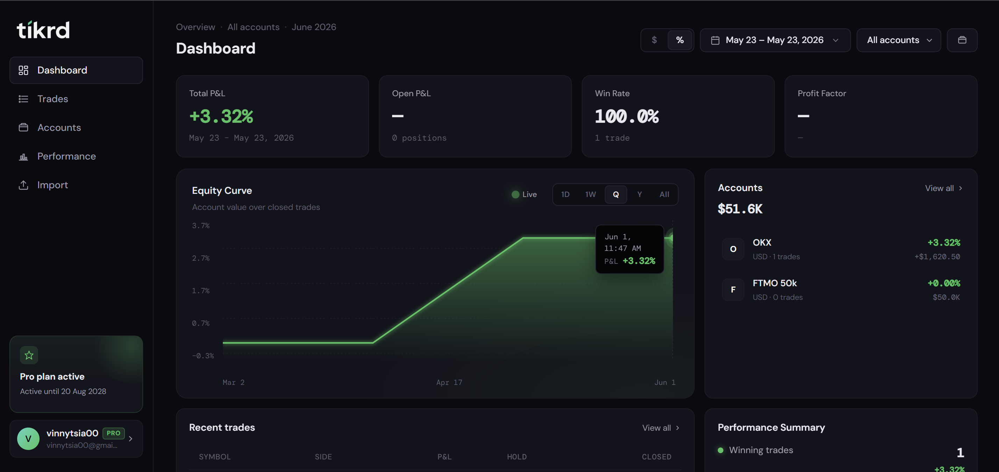
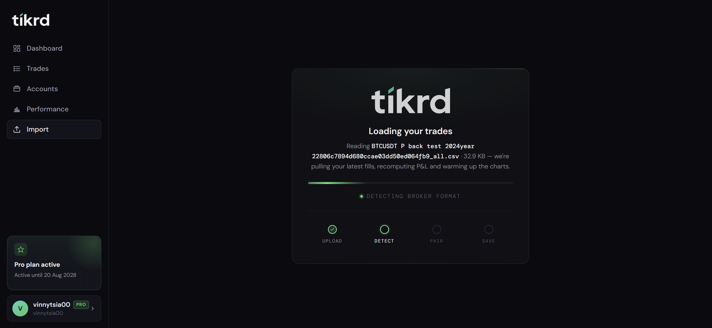

# tikrd.com — Trading Journal for Serious Traders

Turn your closed trades into shareable cards. Auto-import from MT4/MT5 or CSV.

🔗 **Live:** [tikrd.com](https://tikrd.com)

---

## Screenshots

---

## What it does

- **Auto-import trades** from MT4/MT5 via Expert Advisor or CSV upload
- **AI-powered column mapping** — paste any CSV, AI figures out the columns
- **Shareable trade cards** — every closed trade generates a card you can post on X/Twitter
- **Broker support** — works with major brokers out of the box

---

## Tech Stack

| Layer | Tech |
|-------|------|
| Frontend | Next.js, TypeScript, Tailwind CSS |
| Backend | Next.js API Routes, Supabase |
| Database | PostgreSQL (Supabase) |
| Auth | Supabase Auth |
| Payments | Stripe |
| AI | OpenAI API |
| Hosting | Vercel |

---

## Trade Card Preview

---

## CSV Import with AI Mapping

---

## Pricing

| Plan | Price |
|------|-------|
| Free | 50 trades/month |
| Pro | $29/month |

---

[## Pagespeed]([https://tikrd.com](https://pagespeed.web.dev/analysis/https-tikrd-com/ckbi6cm97t?form_factor=desktop&category=performance&category=accessibility&category=best-practices&category=seo&hl=en-US&utm_source=lh-chrome-ext))

Built by [@maxvol123](https://github.com/maxvol123)
